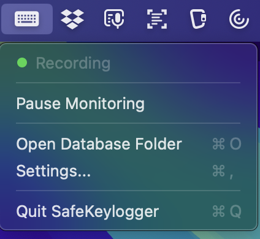
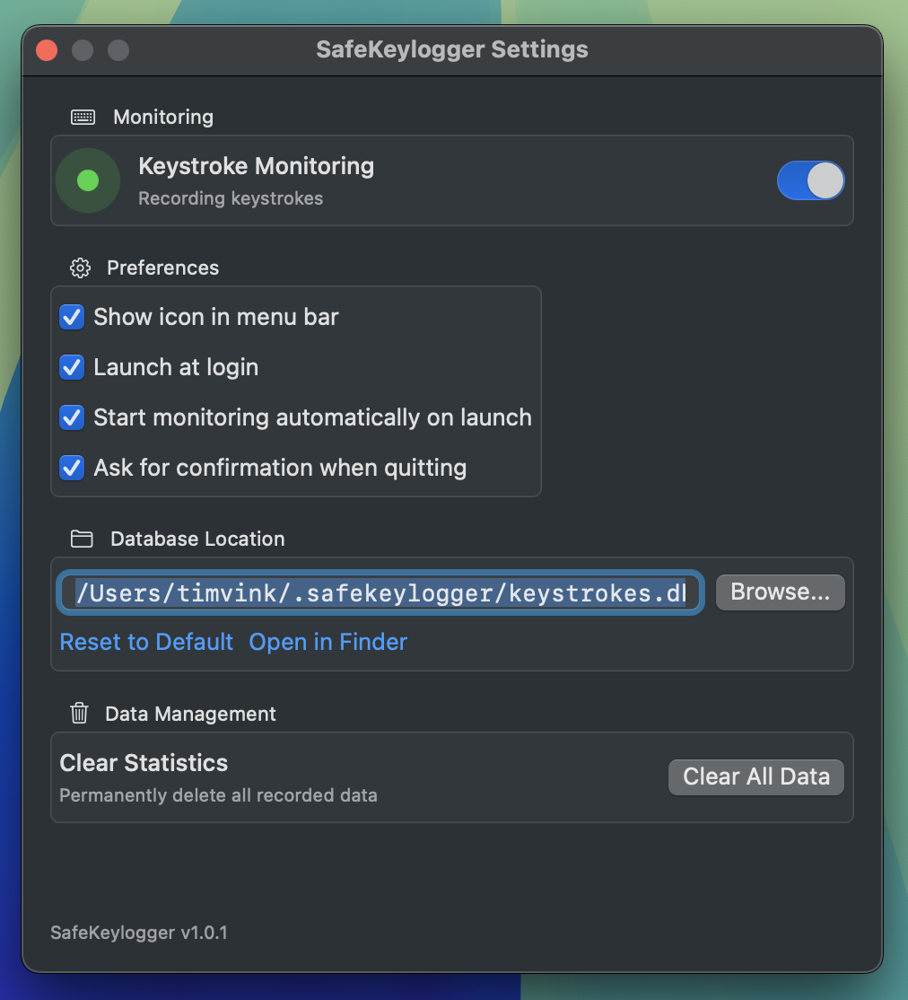

# SafeKeylogger ⌨️

A **privacy-focused** macOS menu bar app that tracks your keystroke statistics without storing what you type.

<p align="center">
  
  
  
</p>

## What is SafeKeylogger?

SafeKeylogger helps you understand your typing patterns by tracking:

- **Character frequency** - Which keys do you press most often?
- **Bigrams** - Common 2-character sequences (like "th", "he", "in")
- **Trigrams** - Common 3-character sequences (like "the", "ing", "and")

### 🔒 Privacy by Design

Unlike traditional keyloggers, SafeKeylogger **never stores your actual keystrokes**:

- Only maintains a tiny 3-character buffer in memory
- Stores only aggregate counts, not sequences
- Buffer is cleared when monitoring stops
- Your raw input is never written to disk

## Features

- 📊 **Real-time statistics** - Watch your typing patterns update live
- 🎯 **Menu bar app** - Lives quietly in your menu bar, no dock icon
- 💾 **Persistent storage** - Stats are saved in a local SQLite database
- ⚡ **Lightweight** - Minimal CPU and memory footprint
- 🔐 **Privacy-first** - Aggregate data only, no keystroke logging

## Screenshots

 


## Installation

### Requirements

- macOS 13.0 (Ventura) or later
- Accessibility permission (required to capture keystrokes)

### Download

Download the latest release from the [Releases](../../releases) page.

### Build from Source

```bash
# Clone the repository
git clone https://github.com/yourusername/safekeylogger.git
cd safekeylogger/SafeKeylogger

# Build
swift build -c release

# Run
swift run
```

## Usage

1. **Launch the app** - A keyboard icon appears in your menu bar
2. **Grant permission** - Click "Enable Accessibility" and allow the app in System Settings
3. **Start typing** - Your keystroke statistics will begin accumulating
4. **View stats** - Click the menu bar icon to see your typing patterns

### Granting Accessibility Permission

SafeKeylogger requires Accessibility permission to capture keystrokes system-wide:

1. Open **System Settings** → **Privacy & Security** → **Accessibility**
2. Enable **SafeKeylogger** in the list
3. You may need to unlock the settings first (click the lock icon)

## Data Storage

Statistics are stored in a SQLite database at:
```
~/.safekeylogger/keystrokes.db
```

You can change this location in the Settings tab.

### Inspecting Your Data

```bash
sqlite3 ~/.safekeylogger/keystrokes.db
sqlite> SELECT * FROM characters ORDER BY count DESC LIMIT 10;
sqlite> SELECT * FROM bigrams ORDER BY count DESC LIMIT 10;
sqlite> SELECT * FROM trigrams ORDER BY count DESC LIMIT 10;
```

## Building a DMG for Distribution

```bash
./scripts/create-dmg.sh
```

This creates `build/SafeKeylogger-1.0.0.dmg`.

## Contributing

Contributions are welcome! Please read [CONTRIBUTING.md](CONTRIBUTING.md) for details on the architecture and development workflow.

## Troubleshooting

### App doesn't capture keystrokes
Make sure Accessibility permission is granted in System Settings → Privacy & Security → Accessibility.

### Stats aren't updating
- Check that monitoring is enabled (green indicator in the popover)
- Verify the database path is writable

### App doesn't appear in menu bar
- The app may already be running - check Activity Monitor
- Try quitting and relaunching

## License

This project is licensed under the MIT License - see the [LICENSE](LICENSE) file for details.

## Acknowledgments

- [GRDB.swift](https://github.com/groue/GRDB.swift) - SQLite toolkit for Swift
- Inspired by typing analysis tools and the desire to understand keyboard habits without compromising privacy

---

<p align="center">
  <sub>Built with ❤️ for privacy-conscious typists</sub>
</p>
