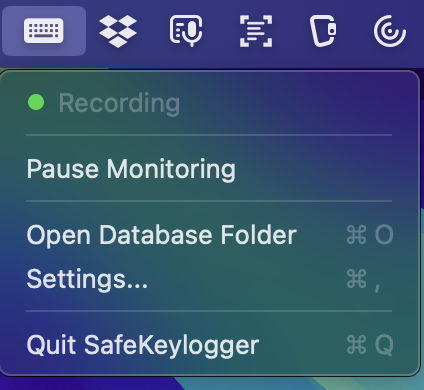
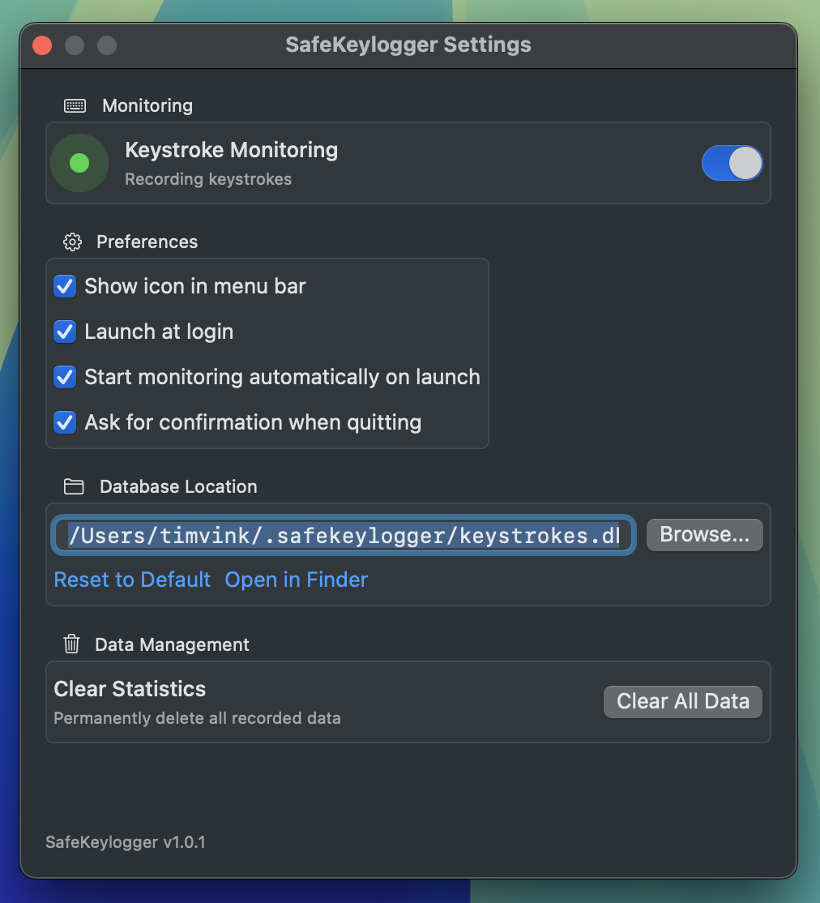

# SafeKeylogger

A **privacy-focused** macOS menu bar app that tracks your keystroke statistics without storing what you type.

<p align="center">
  
  
  
</p>

## What is SafeKeylogger?

SafeKeylogger helps you understand your typing patterns by tracking:

- **Character frequency** - Which keys do you press most often?
- **Bigrams** - All 2-character sequences (like "th", "he", "in")
- **Trigrams** - All 3-character sequences (like "the", "ing", "and")
- **Typing activity** - Daily and hourly keystroke counts

### Privacy by Design

Unlike traditional keyloggers, SafeKeylogger **never stores your actual keystrokes**:

- Only maintains a tiny 3-character buffer in memory
- Stores only aggregate counts, not sequences
- Buffer is cleared when monitoring stops
- Your raw input is never written to disk

## Features

- Real-time statistics - Watch your typing patterns update live
- Menu bar app - Lives quietly in your menu bar, no dock icon
- Persistent storage - Stats are saved in a local SQLite database
- Lightweight - Minimal CPU and memory footprint
- Privacy-first - Aggregate data only, no keystroke logging

## Screenshots

 

## Installation

### Requirements

- macOS 13.0 (Ventura) or later
- Accessibility permission (required to capture keystrokes)

### Download

1. Download the latest `.dmg` from the [Releases](../../releases) page
2. Open the DMG and drag **SafeKeylogger** to your Applications folder
3. Launch from Applications or Spotlight

## Usage

1. **Launch the app** - A keyboard icon appears in your menu bar
2. **Grant permission** - Click "Enable Accessibility" and allow the app in System Settings
3. **Start typing** - Your keystroke statistics will begin accumulating
4. **View stats** - Click the menu bar icon to see your typing patterns

### Granting Accessibility Permission

SafeKeylogger requires Accessibility permission to capture keystrokes system-wide:

1. Open **System Settings** > **Privacy & Security** > **Accessibility**
2. Enable **SafeKeylogger** in the list
3. You may need to unlock the settings first (click the lock icon)

## Data Storage

Statistics are stored in a SQLite database at:
```
~/.safekeylogger/keystrokes.db
```

You can change this location in the Settings tab.

## Troubleshooting

### App doesn't capture keystrokes
Make sure Accessibility permission is granted in System Settings > Privacy & Security > Accessibility.

### Stats aren't updating
- Check that monitoring is enabled (green indicator in the menu)
- Verify the database path is writable

### App doesn't appear in menu bar
- The app may already be running - check Activity Monitor
- Try quitting and relaunching

## Contributing

Contributions are welcome! See [CONTRIBUTING.md](CONTRIBUTING.md) for architecture details and development workflow.

## License

This project is licensed under the MIT License - see the [LICENSE](LICENSE) file for details.

## Acknowledgments

- [GRDB.swift](https://github.com/groue/GRDB.swift) - SQLite toolkit for Swift
- Inspired by typing analysis tools and the desire to understand keyboard habits without compromising privacy
